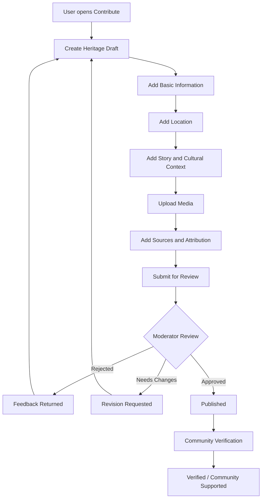
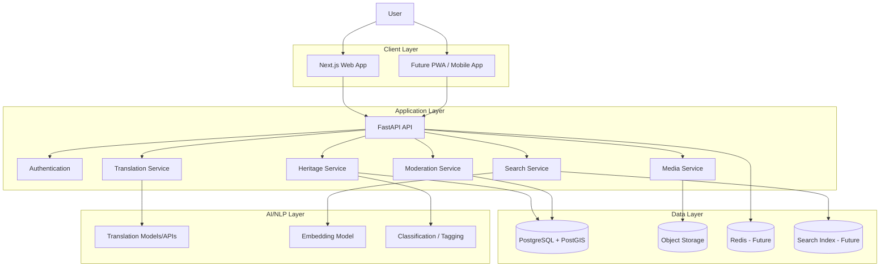
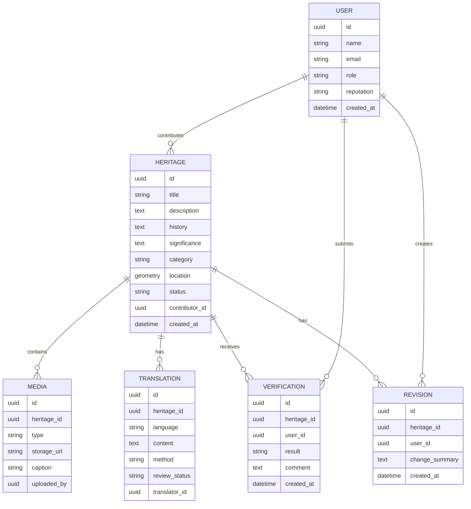
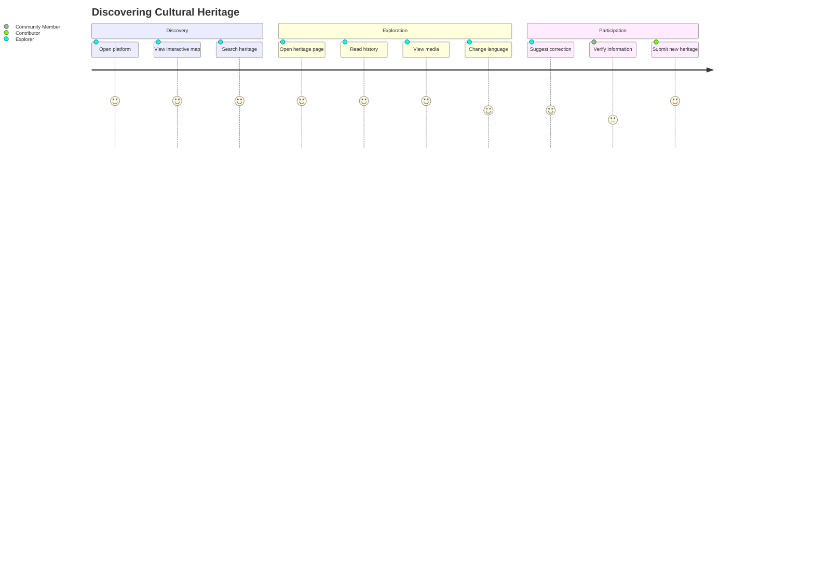

# Cultural Heritage Archive Platform
## Product Requirements Document & Technical Specification

**Document Version:** 1.0  
**Status:** Draft / Architecture Specification  
**Project Type:** Community-driven digital cultural heritage archive  
**Initial Geographic Focus:** Nepal, with emphasis on local and regional heritage  
**Initial Languages:** Nepali, Maithili, English, Bhojpuri

---

# 1. Executive Summary

The Cultural Heritage Archive is a community-driven web platform for discovering, documenting, preserving, and sharing local cultural heritage.

Users can submit heritage sites, traditions, festivals, historical locations, monuments, architecture, oral histories, images, videos, and audio stories. Each heritage item is connected to a geographic location and displayed on an interactive map.

The platform combines:

- Digital archiving
- Interactive maps
- Community contribution
- Human moderation
- Community verification
- Multilingual content
- AI-assisted translation and discovery

The initial product should be built as a modular web application and later expanded into a Progressive Web App or native mobile application.

---

# 2. Vision

> **Preserve local stories before they disappear.  
> Make heritage discoverable.  
> Let communities tell their own stories.**

The platform should become a living digital archive where cultural knowledge is not merely stored, but continuously documented, verified, translated, connected, and discovered.

---

# 3. Problem Statement

Many local heritage sites and cultural traditions are:

- Poorly documented digitally.
- Known mainly through oral history.
- Scattered across social media and personal archives.
- Available only in one language.
- Difficult to discover geographically.
- Vulnerable to loss as communities and generations change.

A local heritage site may be physically present but digitally invisible.

The platform solves this by connecting:

**People → Stories → Media → Locations → Languages → Community Knowledge**

---

# 4. Product Goals

## Primary Goals

1. Create a structured digital archive of local heritage.
2. Allow communities to contribute knowledge and media.
3. Make heritage discoverable through maps and search.
4. Preserve original cultural narratives and sources.
5. Provide multilingual access.
6. Introduce community-based verification.
7. Create a foundation for future AI-powered cultural discovery.

## Non-Goals for the Initial MVP

The MVP will not initially attempt to:

- Replace official government heritage databases.
- Guarantee academic or legal historical authenticity.
- Build a full social media platform.
- Provide advanced AR/VR experiences.
- Support every language simultaneously.
- Automate cultural truth verification entirely through AI.

AI should assist the archive, not become the authority over the culture.

---

# 5. Target Users

## 5.1 Explorer

A person who wants to discover local heritage.

**Needs:**

- Search for sites.
- Explore a map.
- Read stories.
- View images and videos.
- Change languages.
- Find nearby heritage.

---

## 5.2 Contributor

A local person who knows about a site or tradition.

**Needs:**

- Submit a heritage site.
- Upload images, video, and audio.
- Add historical and cultural stories.
- Credit sources.
- Track submission status.

---

## 5.3 Community Verifier

A trusted community member or knowledgeable individual.

**Needs:**

- Review information.
- Confirm local relevance.
- Suggest corrections.
- Provide evidence or sources.

---

## 5.4 Moderator

A platform reviewer.

**Needs:**

- Review submissions.
- Approve or reject content.
- Handle reports.
- Detect spam and harmful content.
- Manage verification requests.

---

## 5.5 Administrator

The platform owner or organization.

**Needs:**

- Manage users and roles.
- Manage categories and languages.
- Review analytics.
- Manage moderation rules.
- Manage system configuration.

---

# 6. Core Product Concept

Each heritage record is a structured knowledge object.

```text
                    ┌─────────────────────┐
                    │   HERITAGE ENTITY   │
                    └──────────┬──────────┘
                               │
       ┌───────────────────────┼───────────────────────┐
       │                       │                       │
       ▼                       ▼                       ▼
   LOCATION                 STORIES                  MEDIA
       │                       │                       │
       ▼                       ▼                       ▼
   Map Point              History               Images / Video
   Coordinates            Significance          Audio / Documents
   Region                 Oral History
       │                       │                       │
       └───────────────────────┼───────────────────────┘
                               │
                               ▼
                         TRANSLATIONS
                               │
                               ▼
                     VERIFICATION & HISTORY
```

---

# 7. Functional Requirements

## FR-01: User Authentication

Users should be able to:

- Register.
- Log in.
- Log out.
- Reset passwords.
- Manage profiles.

Future:

- Google authentication.
- Organization accounts.
- Verified contributor accounts.

---

## FR-02: Heritage Submission

A contributor can submit:

### Basic Information

- Heritage name.
- Alternative names.
- Description.
- Heritage category.
- Location.
- Region or municipality.

### Cultural Information

- Historical background.
- Cultural significance.
- Traditional practices.
- Associated festivals.
- Local stories and oral history.
- Reasons for preservation.

### Media

- Images.
- Videos.
- Audio narrations.
- Documents.

### Attribution

- Contributor name.
- Source information.
- Community source.
- Historical references.

---

## FR-03: Interactive Map

The map is one of the primary discovery interfaces.

Users can:

- View heritage markers.
- Search within a region.
- Filter by category.
- Select a marker.
- Open a preview card.
- Navigate to the full heritage page.

### Map Interaction

```text
┌──────────────────────────────────────────────────────────┐
│ Search heritage...                         [Language ▼]   │
├──────────────────────────────────────────────────────────┤
│ Categories: [All] [Temple] [Festival] [Monument]        │
├──────────────────────────────────────────────────────────┤
│                                                          │
│              MAP VIEW                                   │
│                                                          │
│                  ●                                       │
│        ●                     ●                           │
│                                                          │
│                         ●                                │
│              ●                                           │
│                                                          │
│     ┌──────────────────────────────┐                     │
│     │ Heritage Site Name            │                     │
│     │ Short description...          │                     │
│     │ [View Heritage]               │                     │
│     └──────────────────────────────┘                     │
│                                                          │
└──────────────────────────────────────────────────────────┘
```

---

## FR-04: Search

Search should support:

### Basic Search

- Name.
- Location.
- Category.
- Region.

### Future Semantic Search

Users should be able to search concepts rather than exact names.

Example:

```text
Query:
"traditional places related to Chhath in Mithila"

        ↓

Semantic Search Engine

        ↓

Related Results:
- Historic ponds
- Chhath ghats
- Local festivals
- Related traditions
```

---

## FR-05: Heritage Detail Page

The heritage page is the core content experience.

### Wireframe

```text
┌──────────────────────────────────────────────────────┐
│ ← Back       Heritage Archive              [Language] │
├──────────────────────────────────────────────────────┤
│                                                      │
│              [ HERO IMAGE / VIDEO ]                  │
│                                                      │
├──────────────────────────────────────────────────────┤
│ Heritage Site Name                                   │
│ 📍 Location     🏷 Category     ✓ Verification Status │
├──────────────────────────────────────────────────────┤
│                                                      │
│ About This Heritage                                  │
│ ──────────────────────────────────────────────────── │
│ Description and cultural context...                  │
│                                                      │
│ Why It Matters                                       │
│ ──────────────────────────────────────────────────── │
│ Historical and cultural significance...              │
│                                                      │
│ History                                              │
│ ──────────────────────────────────────────────────── │
│ Timeline and historical information...                │
│                                                      │
│ 📸 Gallery                                           │
│ [Image] [Image] [Video] [Audio]                      │
│                                                      │
│ 🗺 View on Map                                       │
│                                                      │
│ Sources & Contributors                               │
│                                                      │
│ [Suggest Edit] [Verify] [Report]                     │
└──────────────────────────────────────────────────────┘
```

---

# 8. Contribution Flow



---

# 9. Moderation and Verification

The platform should use a hybrid trust model.

## Stage 1: Automated Checks

Before human review:

- File validation.
- Spam detection.
- Duplicate detection.
- Unsafe content detection.
- Required-field validation.

## Stage 2: Moderator Review

A moderator checks:

- Cultural relevance.
- Completeness.
- Appropriate media.
- Potential misinformation.
- Source attribution.

## Stage 3: Community Verification

Community members can:

- Confirm local relevance.
- Suggest corrections.
- Add additional context.
- Provide sources.

### Content Status Model

```text
DRAFT
  │
  ▼
SUBMITTED
  │
  ▼
UNDER_REVIEW
  │
  ├──► NEEDS_CHANGES
  │         │
  │         └──► SUBMITTED
  │
  ├──► REJECTED
  │
  └──► PUBLISHED
          │
          ▼
   COMMUNITY_VERIFIED
```

---

# 10. Multilingual Architecture

The original content must always be preserved.

```text
                    ┌────────────────────┐
                    │ ORIGINAL CONTENT   │
                    │ Nepali / Maithili  │
                    │ English / Other    │
                    └─────────┬──────────┘
                              │
                              ▼
                      Translation Pipeline
                              │
             ┌────────────────┼────────────────┐
             ▼                ▼                ▼
        Nepali            Maithili          English
             │                │                │
             ▼                ▼                ▼
      Community Review  Community Review  Community Review
```

## Translation Rules

Each translation should store:

- Original content ID.
- Target language.
- Translation text.
- Translation method.
- Translator.
- Review status.
- Version history.

Example:

```text
Heritage Story
│
├── Original: Maithili
│
├── Nepali Translation
│   ├── AI Generated
│   └── Community Reviewed
│
└── English Translation
    ├── AI Generated
    └── Community Reviewed
```

AI-generated translation should never overwrite the original.

---

# 11. System Architecture

## High-Level Architecture



---

# 12. Frontend Architecture

Recommended structure:

```text
frontend/
├── app/
│   ├── (public)/
│   │   ├── page.tsx
│   │   ├── map/
│   │   ├── search/
│   │   └── heritage/[slug]/
│   │
│   ├── (auth)/
│   │   ├── login/
│   │   └── register/
│   │
│   ├── dashboard/
│   │   ├── submissions/
│   │   └── profile/
│   │
│   ├── contribute/
│   │   └── new/
│   │
│   ├── moderator/
│   │   └── review/
│   │
│   └── admin/
│
├── components/
│   ├── map/
│   ├── heritage/
│   ├── media/
│   ├── forms/
│   ├── search/
│   └── ui/
│
├── lib/
│   ├── api/
│   ├── auth/
│   ├── maps/
│   └── utils/
│
├── hooks/
├── types/
└── config/
```

## Frontend Principles

- Server-side rendering where useful.
- Client-side interactivity for maps and media.
- Reusable components.
- Strong TypeScript types.
- Mobile-first responsive design.
- Progressive enhancement.
- Accessible interface.

---

# 13. Backend Architecture

Recommended modular structure:

```text
backend/
├── app/
│   ├── main.py
│   │
│   ├── api/
│   │   ├── auth.py
│   │   ├── heritage.py
│   │   ├── media.py
│   │   ├── search.py
│   │   ├── translation.py
│   │   └── moderation.py
│   │
│   ├── models/
│   │   ├── user.py
│   │   ├── heritage.py
│   │   ├── media.py
│   │   ├── translation.py
│   │   └── verification.py
│   │
│   ├── schemas/
│   ├── services/
│   │   ├── heritage_service.py
│   │   ├── media_service.py
│   │   ├── translation_service.py
│   │   └── moderation_service.py
│   │
│   ├── core/
│   │   ├── config.py
│   │   ├── security.py
│   │   └── database.py
│   │
│   └── workers/
│       ├── translation_worker.py
│       └── media_worker.py
│
└── tests/
```

---

# 14. Database Design

## Main Entities



---

# 15. API Design

Base URL:

```text
/api/v1
```

## Authentication

```text
POST   /auth/register
POST   /auth/login
POST   /auth/logout
GET    /auth/me
```

## Heritage

```text
GET    /heritage
POST   /heritage
GET    /heritage/{id}
PATCH  /heritage/{id}
DELETE /heritage/{id}
```

## Search

```text
GET /search?q=...
GET /search/nearby?lat=...&lng=...
```

## Media

```text
POST   /media/upload
GET    /media/{id}
DELETE /media/{id}
```

## Translation

```text
POST /heritage/{id}/translate
GET  /heritage/{id}/translations
PATCH /translations/{id}
```

## Verification

```text
POST /heritage/{id}/verify
GET  /heritage/{id}/verifications
```

## Moderation

```text
GET  /moderation/queue
POST /moderation/{id}/approve
POST /moderation/{id}/reject
POST /moderation/{id}/request-changes
```

---

# 16. Main User Journey



---

# 17. MVP Scope

The first working version should be intentionally small.

## MVP Features

### Public

- Homepage.
- Interactive map.
- Heritage search.
- Heritage detail page.
- Image gallery.
- Language selector.

### User

- Registration and login.
- Submit heritage.
- Upload images.
- Track submission status.

### Moderator

- Review queue.
- Approve.
- Reject.
- Request changes.

### Backend

- REST API.
- PostgreSQL database.
- Geographic coordinates.
- Object storage.
- Basic authentication.

### Exclude from MVP

- Semantic search.
- AI knowledge graph.
- Complex reputation system.
- Native mobile application.
- Advanced video processing.

---

# 18. Phase-Wise Implementation Plan

## Phase 0 — Planning and Foundation

**Goal:** Establish the technical foundation.

Tasks:

- Create Git repository.
- Define project conventions.
- Set up frontend.
- Set up backend.
- Configure database.
- Create environment configuration.
- Set up CI/CD.
- Define API conventions.

Deliverable:

```text
Frontend ↔ Backend ↔ Database
```

---

## Phase 1 — Core Archive MVP

**Goal:** A working digital archive.

Build:

- User authentication.
- Heritage CRUD.
- Image uploads.
- Map display.
- Search.
- Heritage details.
- Moderator approval.

Success condition:

> A user can submit a heritage site, a moderator can approve it, and another user can discover it on the map.

---

## Phase 2 — Community Layer

Build:

- Community verification.
- Comments.
- Suggestions.
- Reporting.
- Contributor profiles.
- Revision history.

Success condition:

> The archive can improve through community participation.

---

## Phase 3 — Multilingual Layer

Build:

- Translation service.
- Language-specific content.
- Translation review.
- Translation version history.

Initial languages:

```text
English
Nepali
Maithili
Bhojpuri
```

Success condition:

> A user can read the same heritage record in multiple languages without losing the original content.

---

## Phase 4 — AI Discovery

Build:

- Semantic search.
- AI tagging.
- Related heritage recommendations.
- Duplicate detection.
- Similar-story discovery.

Example:

```text
"Show me heritage related to traditional water bodies"

                ↓

Semantic Search

                ↓

Related:
- Historic ponds
- Ghats
- Wells
- Festival locations
```

---

## Phase 5 — Cultural Knowledge Network

Build:

```text
HERITAGE SITE
      │
      ├── Associated Festival
      │
      ├── Traditional Practice
      │
      ├── Historical Figure
      │
      ├── Local Community
      │
      └── Related Heritage Site
```

This evolves the product from an archive into a connected cultural knowledge network.

---

# 19. Deployment Architecture

```text
                         USERS
                           │
                           ▼
                    ┌─────────────┐
                    │  CDN / DNS  │
                    └──────┬──────┘
                           │
             ┌─────────────┴─────────────┐
             ▼                           ▼
      ┌──────────────┐            ┌──────────────┐
      │  Next.js App │            │  FastAPI API │
      └──────────────┘            └──────┬───────┘
                                         │
                         ┌───────────────┼───────────────┐
                         ▼               ▼               ▼
                  PostgreSQL        Object Storage   AI Services
                   + PostGIS
```

Recommended initial deployment:

- Frontend: managed frontend hosting.
- Backend: containerized FastAPI service.
- Database: managed PostgreSQL with PostGIS support.
- Media: object storage.
- AI: external API or separately hosted model.

---

# 20. Security Requirements

The platform must:

- Hash passwords securely.
- Use HTTPS.
- Validate uploaded files.
- Limit upload sizes.
- Restrict file types.
- Enforce role-based permissions.
- Protect moderation APIs.
- Prevent unauthorized content modification.
- Maintain revision history.
- Avoid exposing private user data.

---

# 21. Content Integrity Principles

The archive should follow these principles:

### Original Content Is Immutable

The original contribution should not be silently overwritten.

### Every Change Has a History

```text
Version 1
    ↓
Version 2
    ↓
Version 3
```

### AI Is Assistive

AI can:

- Translate.
- Suggest tags.
- Find similar content.
- Detect duplicates.

AI should not independently decide:

- Whether a cultural belief is true.
- Whether a community's tradition is valid.
- Whether historical claims should be permanently accepted.

---

# 22. Future Feature Ideas

- QR codes at heritage sites.
- Audio storytelling.
- Oral history interviews.
- 360-degree tours.
- Offline mobile access.
- Educational collections.
- Research APIs.
- Digital preservation partnerships.
- Community heritage challenges.
- Interactive cultural timelines.
- Heritage route planning.
- AR-based historical overlays.

---

# 23. Definition of MVP Success

The MVP is successful when:

1. A contributor can submit a local heritage site.
2. The contributor can add a story and images.
3. A moderator can review the submission.
4. Approved heritage appears on the map.
5. Visitors can search and explore it.
6. The original content is preserved.
7. The architecture can support future multilingual and AI features without requiring a complete rewrite.

---

# 24. Recommended Build Order

```text
1. Repository & Project Setup
          ↓
2. Database Schema
          ↓
3. Authentication
          ↓
4. Heritage CRUD
          ↓
5. Media Upload
          ↓
6. Map Integration
          ↓
7. Search
          ↓
8. Moderation
          ↓
9. Public Heritage Pages
          ↓
10. Multilingual System
          ↓
11. Community Verification
          ↓
12. AI Features
```

---

# 25. Product Philosophy

This should not begin as an enormous platform.

The first version should answer one simple question:

> **Can a person document a piece of local heritage, and can another person discover and understand it?**

If the answer is yes, the foundation works.

Everything else—AI, semantic search, knowledge graphs, mobile apps, AR, and advanced discovery—can grow on top of that foundation.

**Start as an archive.  
Grow into a cultural knowledge network.**
